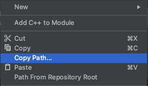
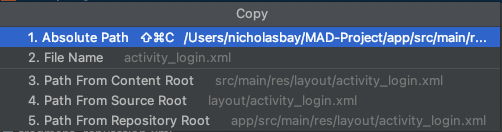
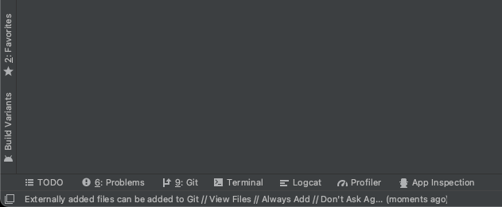

# ET0529: Mobile Applications Development
## MAD Mini Project
> Singapore Polytechnic (SP), Diploma in Computer Engineering (DCPE)\
> Link to [SP Blackboard Main Page](https://esp.sp.edu.sg/webapps/blackboard/execute/announcement?method=search&context=course_entry&course_id=_66527_1&handle=announcements_entry&mode=viewc)\
> Link to [Timeline](https://esp.sp.edu.sg/webapps/blackboard/content/listContent.jsp?course_id=_66527_1&content_id=_1833471_1&mode=reset)\
> Link to [SP MAD Boundnotes](https://esp.sp.edu.sg/bbcswebdav/pid-1931580-dt-content-rid-11573154_2/xid-11573154_2)\
> **Project Proposal**\
> Shopee Product & Design Challenge\
> Taking into consideration Shopee’s current initiatives on its mobile app in the respective markets and the local consumer behaviour, propose a solution that focuses on:
> 1. Improving an existing feature, OR/AND
> 2. Creating a new feature that would enable Shopee to remain the leading e-commerce platform in your chosen market.
Areas that your solution can target, but are not limited to: Listings, Search, Recommendation, Marketing, Supply Chain, Financial Services, Anti-Fraud, and Notification Channels.\
> - For more details refer to: [Link](https://careers.shopee.sg/productdesign2021/#competition)

---
## Guide to upload code to github
1. Right click on selected file, copy absolute path
> \
> 
2. Click on terminal at bottom left
> 
3. ```git add PATH```
4. ```git commit -m "YOUR MESSAGE"```
5. ```git push```
